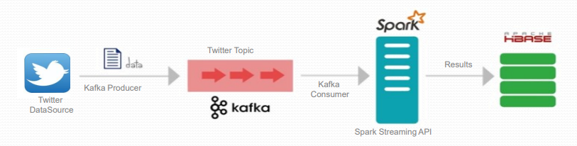
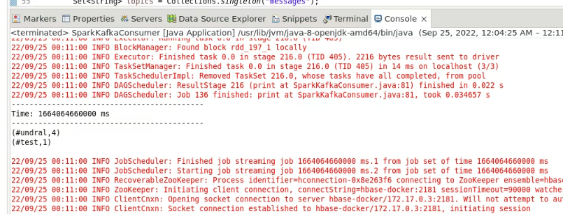

# Spark Streaming integration with kafka and HBase

This project aims to demonstrate how spark streaming can be integrated with kafka and HBase.


## Prerequisite

- Spark
- HBase
- Kafka
- JDK 8

We can use Cloudera Quickstart VM and install Kafka on it. 
Refer to: https://hevodata.com/blog/how-to-install-kafka-on-ubuntu/

## Flow


## Projects
- spark 
> Spark Streaming project that counts hashtags in real-time Kafka consumer data and stores the results in HBase
- twitter
> Uses twitter SDK to get real-time twitter data and produce to Kafka

**Build projects**
```
mvn clean package
```
**Run**
```
java -jar <path_to_jar>
```
 **Spark-submit**
```     
      export JAVA_HOME=/usr/lib/jvm/jre-1.8.0-openjdk.x86_64 && \
      export HADOOP_CONF_DIR=$HADOOP_HOME/etc/hadoop && \
      export YARN_CONF_DIR=$HADOOP_HOME/etc/hadoop && \
      export SPARK_KAFKA_VERSION=0.10 && \
      spark-submit \
      --class edu.miu.cs523.project.SparkKafkaConsumer \
      --master yarn \
      --deploy-mode client \
      <path_to_jar>
```
## Test with Kafka console producer
We can test our spark streaming project by producing custom data using kafka console producer. 
```
$KAFKA_HOME/bin/kafka-console-producer.sh --bootstrap-server localhost:9092 --topic <topic>
```



## Demo video
https://web.microsoftstream.com/video/b6fc5647-5dc9-42dd-9793-54b3dd67c0e3

## References
- https://github.com/twitterdev/twitter-api-java-sdk
- https://github.com/dajobe/hbase-docker
